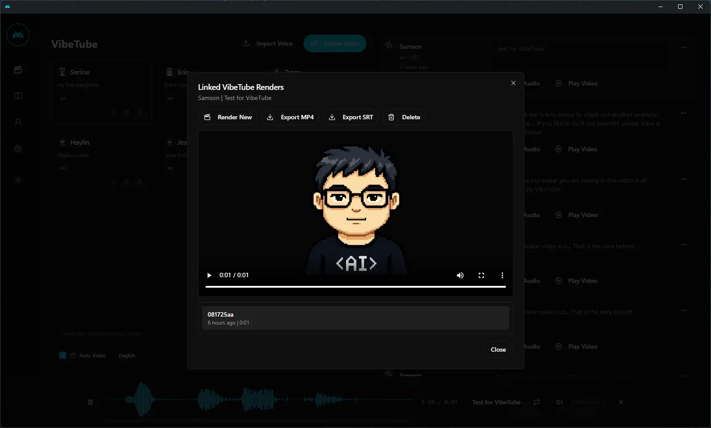
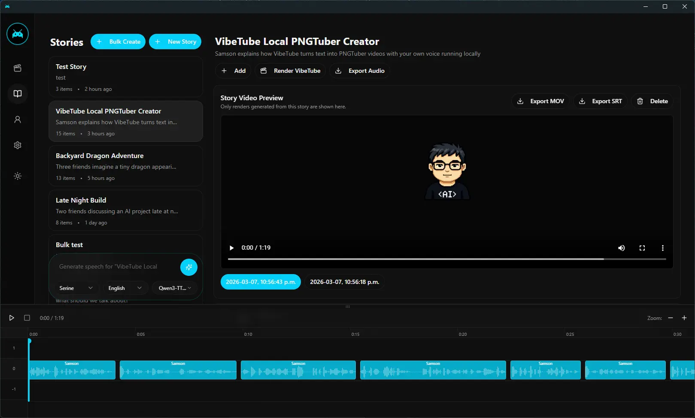
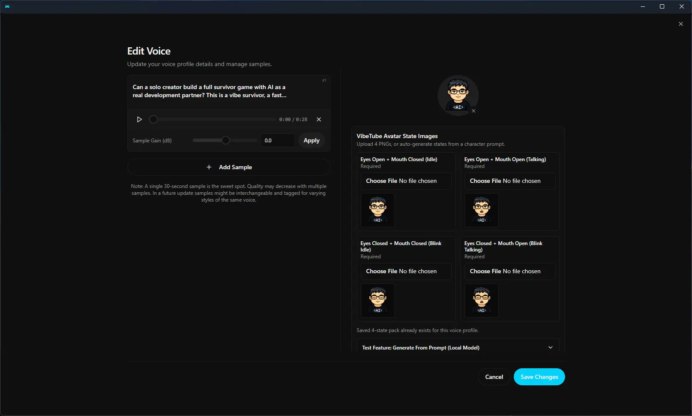

<p align="center">
  
</p>

<h1 align="center">VibeTube</h1>

<p align="center">
  <strong>The open-source voice synthesis studio.</strong><br/>
  Clone voices. Generate speech. Build voice-powered apps.<br/>
  All running locally on your machine.
</p>

<p align="center">
  <a href="https://github.com/jamiepine/VibeTube/releases">
    
  </a>
  <a href="https://github.com/jamiepine/VibeTube/releases/latest">
    
  </a>
  <a href="https://github.com/jamiepine/VibeTube/stargazers">
    
  </a>
  <a href="https://github.com/jamiepine/VibeTube/blob/main/LICENSE">
    
  </a>
</p>

<p align="center">
  <a href="https://VibeTube.sh">VibeTube.sh</a> •
  <a href="#download">Download</a> •
  <a href="#features">Features</a> •
  <a href="#api">API</a> •
  <a href="#roadmap">Roadmap</a>
</p>

<br/>

<p align="center">
  <a href="https://VibeTube.sh">
    
  </a>
</p>

<p align="center">
  <em>Click the image above to watch the demo video on <a href="https://VibeTube.sh">VibeTube.sh</a></em>
</p>

<br/>

<p align="center">
  
</p>

<p align="center">
  
</p>

<br/>

## What is VibeTube?

VibeTube is a **local-first voice cloning studio** with DAW-like features for professional voice synthesis. Think of it as a **local, free and open-source alternative to ElevenLabs** — download models, clone voices, and generate speech entirely on your machine.

Unlike cloud services that lock your voice data behind subscriptions, VibeTube gives you:

- **Complete privacy** — models and voice data stay on your machine
- **Professional tools** — multi-track timeline editor, audio trimming, conversation mixing
- **Model flexibility** — currently powered by Qwen3-TTS, with support for XTTS, Bark, and other models coming soon
- **API-first** — use the desktop app or integrate voice synthesis into your own projects
- **Native performance** — built with Tauri (Rust), not Electron
- **Super fast on Mac** — MLX backend with native Metal acceleration for 4-5x faster inference on Apple Silicon

Download a voice model, clone any voice from a few seconds of audio, and compose multi-voice projects with studio-grade editing tools. No Python install required, no cloud dependency, no limits.

---

## Download

VibeTube is available now for macOS and Windows.

| Platform | Download |
|----------|----------|
| macOS (Apple Silicon) | [VibeTube_aarch64.app.tar.gz](https://github.com/jamiepine/VibeTube/releases/latest/download/VibeTube_aarch64.app.tar.gz) |
| macOS (Intel) | [VibeTube_x64.app.tar.gz](https://github.com/jamiepine/VibeTube/releases/latest/download/VibeTube_x64.app.tar.gz) |
| Windows (MSI) | [Latest Windows MSI](https://github.com/jamiepine/VibeTube/releases/latest) |
| Windows (Setup) | [Latest Windows Setup](https://github.com/jamiepine/VibeTube/releases/latest) |

> **Linux builds coming soon** — Currently blocked by GitHub runner disk space limitations.

---

## Features

### Voice Cloning with Qwen3-TTS

Powered by Alibaba's **Qwen3-TTS** — a breakthrough model that achieves near-perfect voice cloning from just a few seconds of audio.

- **Instant cloning** — Upload a sample, get a voice profile
- **High fidelity** — Natural prosody, emotion, and cadence
- **Multi-language** — English, Chinese, and more coming
- **Lightning fast on Mac** — MLX backend leverages Apple Silicon's Neural Engine for super fast generation

### Voice Profile Management

- **Create profiles** from audio files or record directly in-app
- **Import/Export** profiles to share or backup
- **Multi-sample support** — combine multiple samples for higher quality cloning
- **Organize** with descriptions and language tags

### Speech Generation

- **Text-to-speech** with any cloned voice
- **Batch generation** for long-form content
- **Smart caching** — regenerate instantly with voice prompt caching

### Stories Editor

Create multi-voice narratives, podcasts, and conversations with a timeline-based editor.

- **Multi-track composition** — arrange multiple voice tracks in a single project
- **Inline audio editing** — trim and split clips directly in the timeline
- **Auto-playback** — preview stories with synchronized playhead
- **Voice mixing** — build conversations with multiple participants

### Recording & Transcription

- **In-app recording** with waveform visualization
- **System audio capture** — record desktop audio on macOS and Windows
- **Automatic transcription** powered by Whisper
- **Export recordings** in multiple formats

### Generation History

- **Full history** of all generated audio
- **Search & filter** by voice, text, or date
- **Re-generate** any past generation with one click

### Flexible Deployment

- **Local mode** — Everything runs on your machine
- **Remote mode** — Connect to a GPU server on your network
- **One-click server** — Turn any machine into a VibeTube server

---

## API

VibeTube exposes a full REST API, so you can integrate voice synthesis into your own apps.

```bash
# Generate speech
curl -X POST http://localhost:8000/generate \
  -H "Content-Type: application/json" \
  -d '{"text": "Hello world", "profile_id": "abc123", "language": "en"}'

# List voice profiles
curl http://localhost:8000/profiles

# Create a profile
curl -X POST http://localhost:8000/profiles \
  -H "Content-Type: application/json" \
  -d '{"name": "My Voice", "language": "en"}'
```

**Use cases:**

- Game dialogue systems
- Podcast/video production pipelines
- Accessibility tools
- Voice assistants
- Content creation automation

Full API documentation available at `http://localhost:8000/docs` when running.

---

## Tech Stack

| Layer | Technology |
|-------|------------|
| Desktop App | Tauri (Rust) |
| Frontend | React, TypeScript, Tailwind CSS |
| State | Zustand, React Query |
| Backend | FastAPI (Python) |
| Voice Model | Qwen3-TTS (PyTorch or MLX) |
| Transcription | Whisper (PyTorch or MLX) |
| Inference Engine | MLX (Apple Silicon) / PyTorch (Windows/Linux/Intel) |
| Database | SQLite |
| Audio | WaveSurfer.js, librosa |

**Why this stack?**

- **Tauri over Electron** — 10x smaller bundle, native performance, lower memory
- **FastAPI** — Async Python with automatic OpenAPI schema generation
- **Type-safe end-to-end** — Generated TypeScript client from OpenAPI spec

---

## Roadmap

VibeTube is the beginning of something bigger. Here's what's coming:

### Coming Soon

| Feature | Description |
|---------|-------------|
| **Real-time Synthesis** | Stream audio as it generates, word by word |
| **Conversation Mode** | Multi-speaker dialogues with automatic turn-taking |
| **Voice Effects** | Pitch shift, reverb, M3GAN-style effects |
| **Timeline Editor** | Audio studio with word-level precision editing |
| **More Models** | XTTS, Bark, and other open-source voice models |

### Future Vision

- **Voice Design** — Create new voices from text descriptions
- **Project System** — Save and load complex multi-voice sessions
- **Plugin Architecture** — Extend with custom models and effects
- **Mobile Companion** — Control VibeTube from your phone

VibeTube aims to be the **one-stop shop for everything voice** — cloning, synthesis, editing, effects, and beyond.

---

## Development

See [CONTRIBUTING.md](CONTRIBUTING.md) for detailed setup and contribution guidelines.

**Using the Makefile (recommended):** Run `make help` to see all available commands for setup, development, building, and testing.

### Quick Start

**With Makefile (Unix/macOS/Linux):**

```bash
# Clone the repo
git clone https://github.com/jamiepine/VibeTube.git
cd VibeTube

# Setup everything
make setup

# Start development
make dev
```

**Manual setup (all platforms):**

```bash
# Clone the repo
git clone https://github.com/jamiepine/VibeTube.git
cd VibeTube

# Install dependencies
bun install

# Install Python dependencies
cd backend && pip install -r requirements.txt && cd ..

# Start development
bun run dev
```

**Prerequisites:** [Bun](https://bun.sh), [Rust](https://rustup.rs), [Python 3.11+](https://python.org). [XCode on macOS](https://developer.apple.com/xcode/).

**Performance:** 
- **Apple Silicon (M1/M2/M3)**: Uses MLX backend with native Metal acceleration for 4-5x faster inference
- **Windows/Linux/Intel Mac**: Uses PyTorch backend (CUDA GPU recommended, CPU supported but slower)

### Project Structure

```
VibeTube/
├── app/              # Shared React frontend
├── tauri/            # Desktop app (Tauri + Rust)
├── web/              # Web deployment
├── backend/          # Python FastAPI server
├── landing/          # Marketing website
└── scripts/          # Build & release scripts
```

---

## Contributing

Contributions welcome! See [CONTRIBUTING.md](CONTRIBUTING.md) for guidelines.

1. Fork the repo
2. Create a feature branch
3. Make your changes
4. Submit a PR

## Security

Found a security vulnerability? Please report it responsibly. See [SECURITY.md](SECURITY.md) for details.

---

## License

MIT License — see [LICENSE](LICENSE) for details.

---

<p align="center">
  <a href="https://VibeTube.sh">VibeTube.sh</a>
</p>
